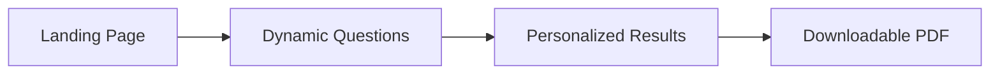

# Paper Prisons ID Tool

## Quick Overview
A friendly web app that walks people through the steps to secure a government ID after incarceration. Answer a handful of questions, then receive personalized guidance and a ready-to-print PDF checklist.



- **Audience:** Individuals reentering the community, case workers, volunteers, and Paper Prisons staff who keep the guidance current.
- **Why it matters:** ID requirements vary by state and change often; the tool centralizes the latest instructions so users get accurate, immediate support.
- **Tech stack:** Next.js 13 (React 18), global CSS, `public-google-sheets-parser`, `@react-pdf/renderer`, static export hosted on GitHub Pages.

## Highlights
- Dynamic questions backed by an editable Google Sheet (no code deploys for content updates).
- Branching logic that shows only the steps each person needs.
- Adjustable text size, responsive layout, and accessible controls.
- One-click PDF summary that mirrors the on-screen guidance.
- Fully static Next.js export ready for GitHub Pages or other static hosts.

## Getting Started
```bash
npm install
npm run dev
```
Open http://localhost:3000 and press **Start**. The form automatically fetches question data from the Google Sheet configured in `src/pages/index.js`.

### Prerequisites
- Node.js 20 (see `.nvmrc`) and npm 8+
- Public access to the Google Sheet `1S9Ac06eAesmc4J8mgEdO6A083H2sfkPKEk7sbg3USGY` or your own published sheet.

## Static Export & Deployment
```bash
npm install
npm run build
```
- `next build` followed by `next export -o docs/` produces a static bundle inside `docs/` (includes `.nojekyll` for GitHub Pages).
- Host the contents of `docs/` on GitHub Pages: https://paperprisons.github.io/paper-prisons-id-tool/
- Re-run the build whenever sheet data or code changes; new hashed assets will appear under `docs/_next/static/`.

## Recent UI Updates
- Dropdown questions now behave as searchable comboboxes; type to filter and confirm with Enter.
- Styling updates keep the combobox aligned with the design system, including keyboard focus states.
- Implementation notes: `docs/ui-combobox-update-notes.md`.
- The results page offers a one-page PDF download of the guidance using `@react-pdf/renderer`; more details in `docs/results-pdf-download.md`.
- Email delivery remains an open task until a transactional provider is configured.

---
For a full technical deep dive (architecture, data flow, contributor notes), read `docs/ProjectDocumentation_V2.md`.


First, run the below command

```
npm i && npm run build
```

Then you can host everything under docs folder. Currently it's hosted as [github pages] with a permanent url([https://paperprisons.github.io/paper-prisons-id-tool/](https://paperprisons.github.io/paper-prisons-id-tool/)) without any downtime.

## How to run it in your local

First, run the development server:

```bash

npm i && npm run dev

```

Then you can check the webpage localhost:3000 in your local.
